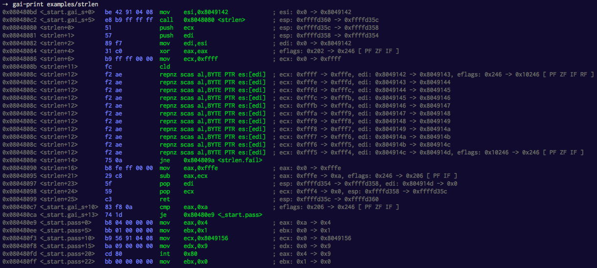

# gai [](http://travis-ci.org/thlorenz/gai)

GDB Assembly Informant steps through your assembly code one instruction at a time and diffs register values.

[](https://raw.githubusercontent.com/thlorenz/gai/master/assets/strlen.png)

<!-- START doctoc generated TOC please keep comment here to allow auto update -->
<!-- DON'T EDIT THIS SECTION, INSTEAD RE-RUN doctoc TO UPDATE -->
**Table of Contents**  *generated with [DocToc](https://github.com/thlorenz/doctoc)*

- [Installation](#installation)
- [Usage](#usage)
  - [Preparation](#preparation)
  - [gai-print](#gai-print)
  - [gai-json](#gai-json)
  - [Other scripts](#other-scripts)
- [Platforms](#platforms)
- [Troubleshooting](#troubleshooting)
- [Examples](#examples)
- [License](#license)

<!-- END doctoc generated TOC please keep comment here to allow auto update -->

## Installation

```
npm install -g gai
```

## Usage

### Preparation

Mark the sections of code you want to investigate with *start* `.gai_s` and *end* `.gai_e` labels.

**Without these labels gai won't work**.

As an example lets take [examples/inc.asm](examples/inc.asm):

```asm
global _start
_start:
  nop

.gai_s:                 ; gai instruction printing starts here
  inc eax
  inc eax

  mov eax, 0xffffffff
  inc eax
  inc eax

.gai_e:                 ; gai instruction printing ends here
  mov eax,1
  mov ebx,0
  int 80H
```

Then assemble the file, i.e. see [examples/Makefile](examples/Makefile).

### gai-print

Launch the following command which will *batch debug* the executable with **gdb** and then pipe the output through
various scripts (see below) to generate the instructions including opcodes and information about modified registers.

```sh
gai-print examples/strlen
```

### gai-json

Works exactly like **gai-print** except that it outputs the information in JSON format to be parsed by other tools.

This is useful in case you are writing an emulator _or similar_ and want to check it against a real CPU. I'm using it
for my [visulator](https://github.com/thlorenz/visulator) project.

```sh
gai-json examples/strlen > out.json
```

### Other scripts

Three more `gai-*` scripts are in your path, mainly so the main scripts can find them in the `npm` bin path. They are of
limited use by themselves so read through them to see if you want to run them directly.

## Platforms

You need gdb and be able to generate assembly with debug symbols. I've tested on **Linux only** and know that it isn't
working on OSX since it cannot generate the debug symbols.

Additionally ATM *gai* expects an **x86** instruction set. However I'm open for PRs that add support for 64-bit.

## Troubleshooting

If something goes wrong, i.e. you get no output, have a look inside the `/tmp/gai__gdb_err.txt` to see if somehow the
**gdb** batch debugging failed to complete properly

You can then manually debug or run the following command to just run the **gdb** batch debug script:

```
gdb -nx --batch -x gai-gdb -f <your-executable>
```

## Examples

In order to play with the examples make sure to have [nasm](http://www.nasm.us/docs.php) installed and are running on a
compatible platform.

Assuming you installed *gai* and cloned this repo, here is how you'd try the `strlen` example.

```sh
cd gai/examples
make strlen
gai-print strlen
```

## License

GPL3
